# Sismenkes Bengkel Koding

Repositori tugas bengkel koding website sismenkes dengan laravel.

```
Nama : Heryawan Eko Saputro
NIM  : A11.2022.14237
```

## Cara menjalankan projek secara lokal

1. Clone repositori:
```bash
git clone https://github.com/yourusername/RavaelaBkod.git
cd RavaelaBkod
```

2. Install dependensi PHP:
```bash
composer install
```

3. Install dependensi node:
```bash
npm install
```

4. Setup environment lokal:
```bash
cp .env.example .env
php artisan key:generate
```

5. Jalankan migrasi beserta seeder:
```bash
php artisan migrate --seed
```

6. Jalankan projek:
```bash
php artisan serve
```

## Route Documentation

### Authentication Routes
| Route | Controller | Middleware | Deskripsi |
|-------|------------|------------|-----------|
| /register | AuthController@showRegisterForm | - | Halaman register |
| /register | AuthController@register | - | Redirect register |
| /login | AuthController@showLoginForm | - | Halaman login |
| /login | AuthController@login | - | Redirect login |
| /logout | AuthController@logout | auth | Redirect logout |

### Doctor Routes
| Route | Controller | Middleware | Description |
|-------|------------|------------|-------------|
| /dokter/dashboard | - | auth, role:dokter | Halaman dokter |
| /dokter/obat | ObatController@index | auth, role:dokter | List obat |
| /dokter/obat/create | ObatController@create | auth, role:dokter | Halaman tambah obat |
| /dokter/obat | ObatController@store | auth, role:dokter | Simpan obat |
| /dokter/obat/{id}/edit | ObatController@edit | auth, role:dokter | Halaman edit obat |
| /dokter/obat/{id} | ObatController@update | auth, role:dokter | Update obat |
| /dokter/obat/{id} | ObatController@destroy | auth, role:dokter | Hapus obat |

### Patient Routes
| URI | Controller | Middleware | Description |
|-----|------------|------------|-------------|
| /pasien/dashboard | - | auth, role:pasien | Patient dashboard |

## Penjelasan implementasi RBAC

1. Role user
- Terdefinisi di kode migrasi user:
```php
$table->enum('role', ['pasien', 'dokter'])->default('pasien');
```

2. Role Middleware
- Terdefinisi in `bootstrap/app.php`:
```php
$middleware->alias([
    'role' => \App\Http\Middleware\RoleMiddleware::class,
]);
```

3. Proteksi Route
- Route Dokter terhalangi dengan middleware `role:dokter`
- Route Pasien terhalangi dengan middleware `role:pasien`
- Dua duanya memerlukan otentikasi melalui middleware `auth`

4. User Model Relations
```php
// Relationship for patient's medical checks
public function pasiens(): HasMany
{
    return $this->hasMany(Periksa::class, 'id_pasien');
}

// Relationship for doctor's medical checks
public function dokters(): HasMany
{
    return $this->hasMany(Periksa::class, 'id_dokter');
}
```

### Testing RBAC

Anda dapan memastikan apakah fungsi RBAC berfungsi atau tidak dengan:
1. Login sebagai dokter - route /dokter/* dapat diakses tetapi route /pasien/* tidak dapat diakses
2. Login sebagai pasien - route /pasien/* dapat diakses tetapi route /dokter/* tidak dapat diakses
3. User ilegal - Otomatis redirect ke halaman login jika membuka halaman yang memerlukan login

### Screenshot akses ditolak

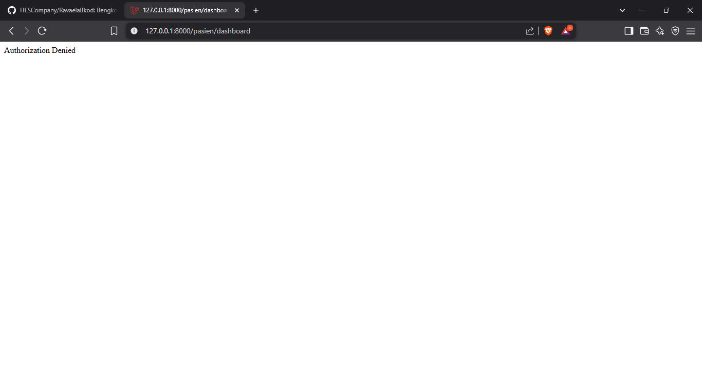
*Dokter ketika mencoba mengakses halaman pasien*

## Skema Database & Model

### File Migrasi

1. Migrasi Detail Periksa
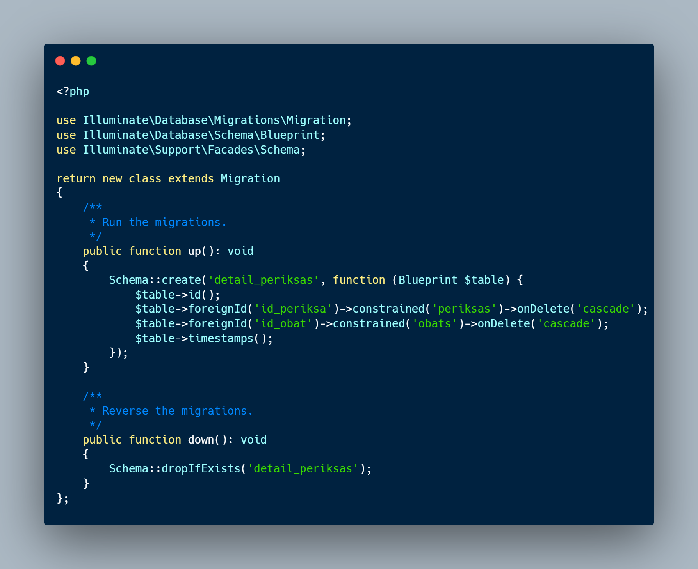
*Migrasi untuk tabel detail_periksas*

2. Obat Migration
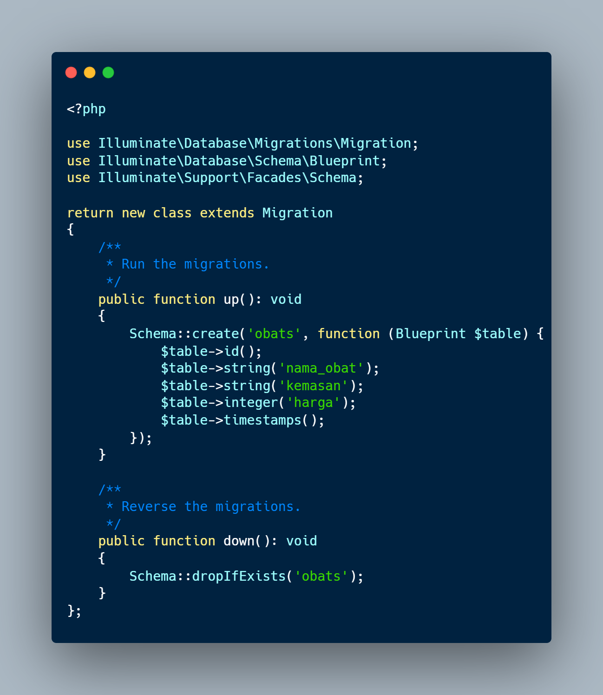
*Migrasi untuk tabel obats*

### Model Files

1. Model Periksa
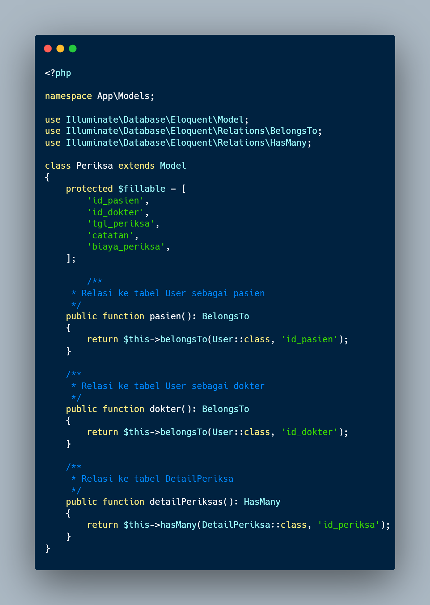
*Implementasi model Periksa dengan relasinya*

2. Model Detail Periksa  
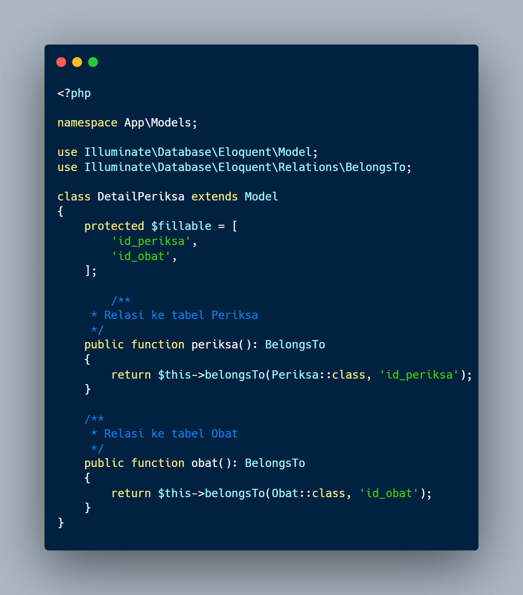
*Implementasi model DetailPeriksa dengan relasinya*

3. Model Obat
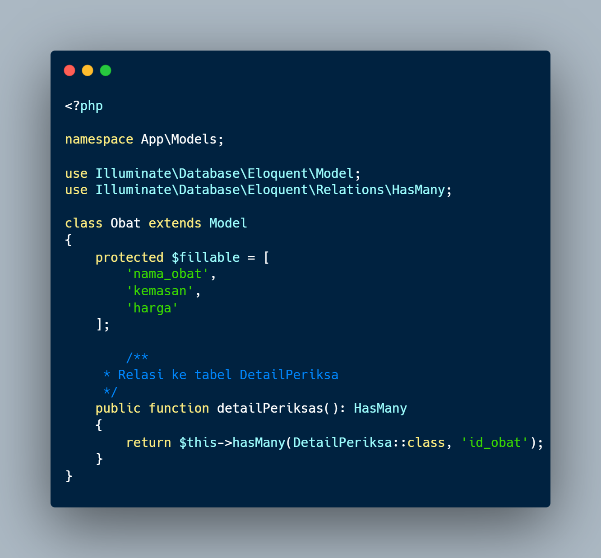
*Implementasi model Obat dengan relasinya*

### Database Setup

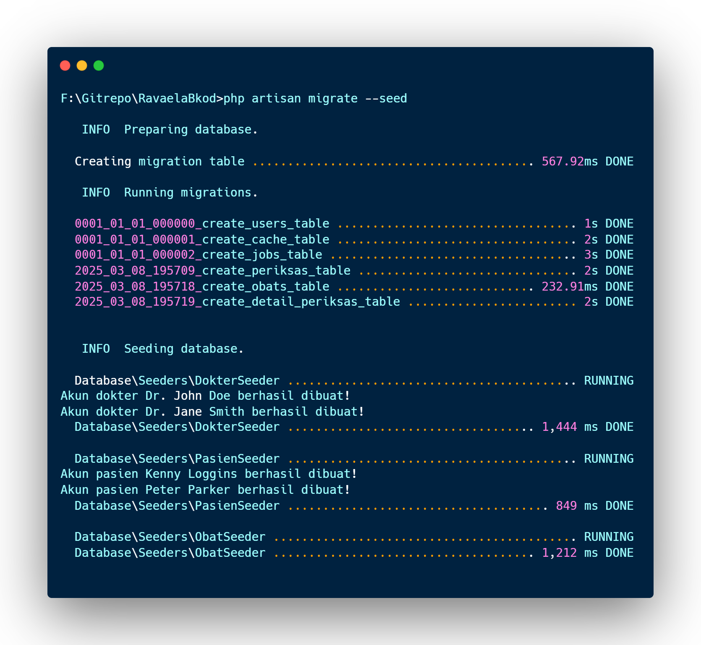
*Screenshot terminal menunjukkan migrasi database berhasil*

## User Interface

### Halaman Publik
1. Landing Page
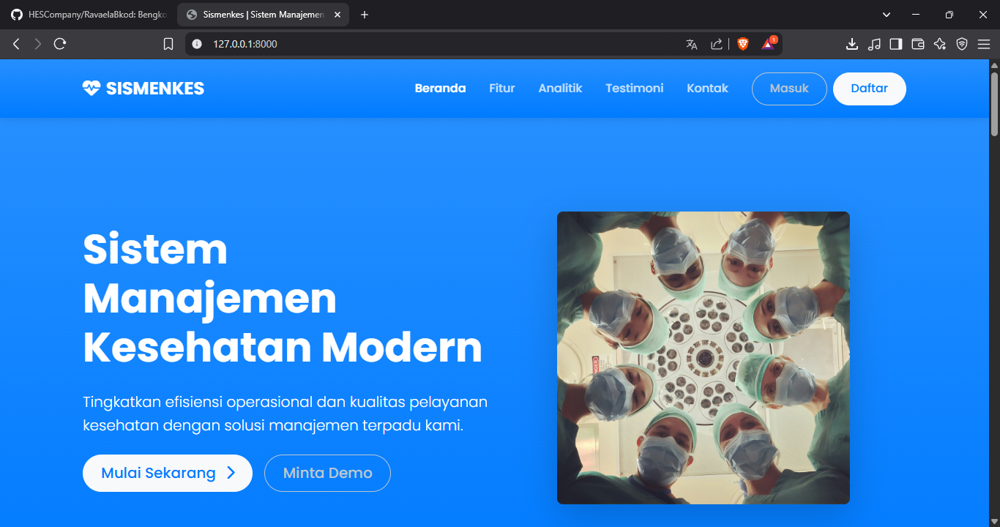
*Halaman awal website yang dapat diakses publik*

2. Halaman Login
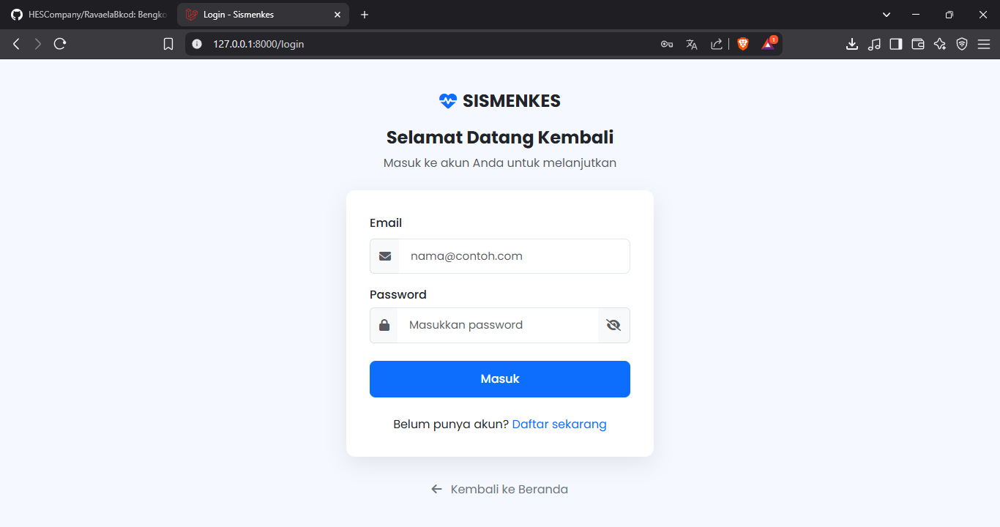 
*Halaman login untuk dokter dan pasien*

3. Halaman Register 
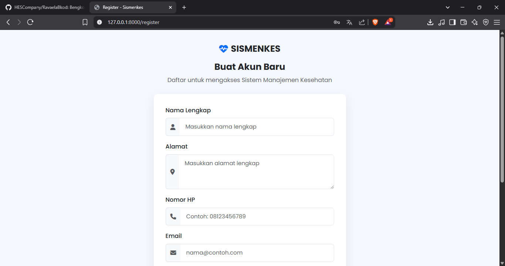
*Halaman pendaftaran untuk pasien baru*

### Halaman Dokter
1. Dashboard
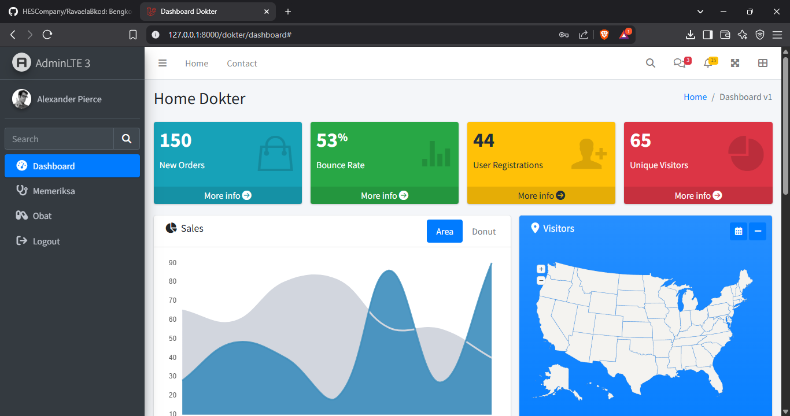
*Halaman dashboard untuk dokter*

3. Daftar Obat  
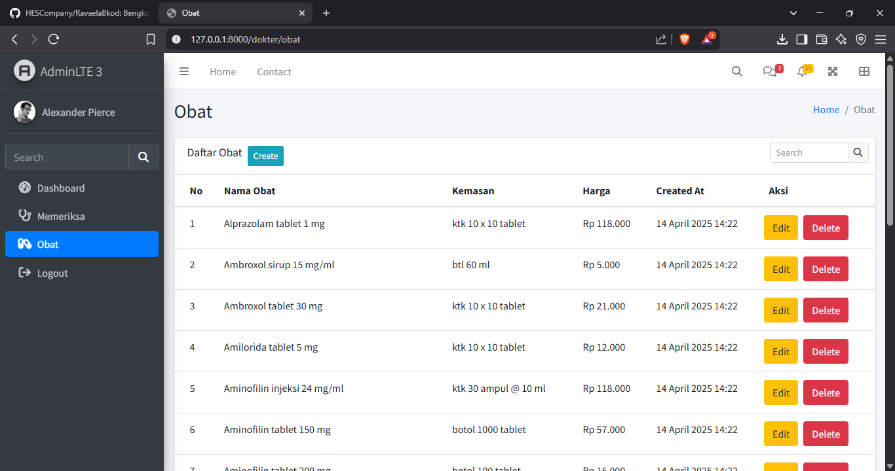
*Halaman pengelolaan daftar obat*

4. Form Tambah Obat
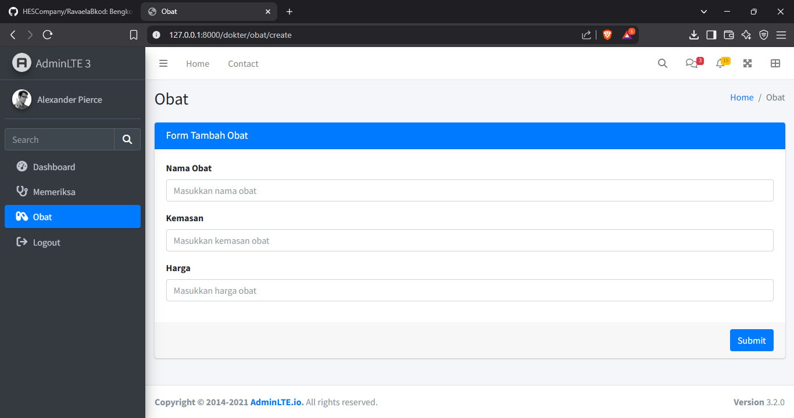
*Form untuk menambahkan obat baru*
